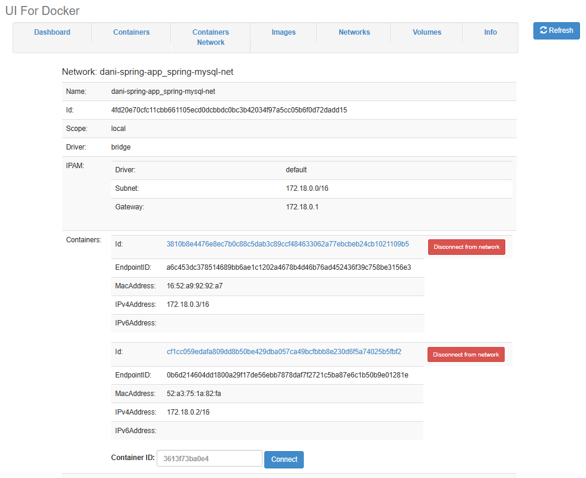

# Shell Script를 활용한 Docker Compose 기반 스프링 부트 & MySQL 자동 백업 솔루션

## 🚦 목차

1. [📒 개요](#overview)
   - [프로젝트 목표 🎯](#project-goals)
   - [주요 기능 🌟](#features)
2. [📖 프로젝트 설명](#project-description)
   - [구성 요소 📌](#components)
   - [워크플로우 🔁](#workflow)
3. [🚀 활용 기술](#technologies)

4. [🏗️⚙️ 구현 및 실행](#implementation)
   - [파일 및 디렉토리 구조 📁](#directory-structure)
   - [구성 파일 및 스크립트 설명 📝](#config-and-scripts)
   - [사전 요구사항 및 실행 방법 ▶️](#requirements-and-usage)
5. [🔫 트러블슈팅](#troubleshooting)

6. [💡 고찰 및 개선점](#improvements)

---

## <a id="overview"></a>📒 개요
이 프로젝트는 **Docker**와 **Docker Compose**를 활용하여 Spring Boot 기반 애플리케이션과 MySQL 데이터베이스를 **컨테이너화**하여 쉽고 **효율적인 배포 환경**을 구축하는 것을 목표로 합니다. 또한, MySQL 데이터베이스의 **주기적 백업 자동화**를 통해 **데이터 보호와 복구**에 대비할 수 있는 시스템을 구현하였습니다.

### <a id="project-goals"></a>프로젝트 목표 🎯
- **컨테이너화된 배포 환경 구축**  
  Docker와 Docker Compose를 사용하여 애플리케이션과 데이터베이스를 각각 독립된 컨테이너로 배포 및 관리합니다.

- **자동 백업 시스템 구현**  
  주기적으로 MySQL 데이터베이스의 데이터를 백업함으로써 데이터 손실 위험에 대비하고, 신속한 복구가 가능하도록 합니다.

- **유지보수 및 확장성 확보**  
  환경 변수 관리, 헬스 체크, 의존성 설정 등 구성 파일과 스크립트를 통한 체계적인 관리로 프로젝트 유지보수와 향후 확장을 용이하게 합니다.

### <a id="features"></a>주요 기능 🌟
- **Docker 기반 실행:**  
  Dockerfile과 docker-compose.yml을 통해 애플리케이션 및 MySQL 데이터베이스 컨테이너를 손쉽게 구축하고 실행합니다.

- **헬스 체크 기능:**  
  컨테이너 내부에서 주기적으로 애플리케이션의 상태를 확인하여 서비스 정상 운영 여부를 모니터링합니다.

- **데이터베이스 백업 자동화:**  
  backup.sh 스크립트와 crontab 설정을 이용해 MySQL 데이터베이스의 정기적인 백업을 자동으로 수행합니다.

- **환경 변수 및 설정 관리:**  
  .env 파일을 통해 데이터베이스 및 서버 관련 설정을 중앙 집중식으로 관리하여 다양한 환경에 유연하게 대응할 수 있습니다.

- **서비스 간 의존성 관리:**  
  docker-compose의 `depends_on`과 헬스 체크를 활용하여 서비스 간 의존성을 효과적으로 제어합니다.

---

## <a id="project-description"></a>📖 프로젝트 설명
이 프로젝트는 Docker와 Docker Compose를 활용하여 Spring Boot 애플리케이션과 MySQL 데이터베이스를 효과적으로 **컨테이너화한 배포 환경**을 제공합니다. 이를 통해 배포 및 관리 과정에서 환경 설정의 차이로 발생할 수 있는 문제를 줄이고, 운영 작업을 보다 간편하게 수행할 수 있습니다. 또한, 자동화 스크립트(run.sh, backup.sh)와 crontab 연동을 통해 **애플리케이션 빌드, 실행, 모니터링, 데이터베이스 백업 등의 주요 작업을 자동화**하여 시스템 관리를 효율적으로 지원합니다.

### <a id="components"></a>구성 요소 📌
- **Spring Boot 애플리케이션**  
  Java 기반의 Spring Boot 애플리케이션으로, Dockerfile을 통해 OpenJDK 17-slim 이미지를 기반으로 빌드됩니다. REST API 엔드포인트와 헬스 체크 기능을 제공하여 서비스의 상태를 모니터링합니다.

- **MySQL 데이터베이스**  
  MySQL 8.0을 사용하여 애플리케이션 데이터를 저장합니다. docker-compose.yml 파일에서 정의된 볼륨을 통해 데이터의 지속성을 보장하며, 환경 변수로 데이터베이스 설정을 관리합니다.

- **Dockerfile 및 Docker Compose**  
  - **Dockerfile**  
    애플리케이션 실행 환경을 구성하고, 필요한 패키지(curl 등)를 설치하며, JAR 파일을 컨테이너 이미지에 복사하여 실행합니다.
  - **docker-compose.yml**  
    Spring Boot 애플리케이션과 MySQL 데이터베이스 컨테이너를 정의하고, 네트워크, 볼륨, 환경 변수 및 서비스 간 의존성을 설정합니다.

- **환경 변수 파일 (.env)**  
  데이터베이스 연결 정보와 서버 설정 등을 중앙에서 관리하여, 다양한 환경에서 동일한 구성을 재사용하고 필요에 따라 쉽게 변경할 수 있습니다. 이를 통해 설정 관리의 일관성과 효율성을 높입니다.

- **백업 및 실행 스크립트**  
  - **backup.sh**  
    MySQL 데이터베이스 컨테이너 내에서 `mysqldump` 명령어를 실행해 정기적으로 데이터를 백업하며, 생성된 백업 파일은 지정된 디렉토리에 저장됩니다.
  - **run.sh**  
    프로젝트 실행 전 Docker와 Docker Compose 설치 여부를 확인하고, 기존 컨테이너를 정리한 후 새로운 컨테이너를 빌드 및 시작하는 자동화 스크립트입니다.

- **크론 작업**  
  crontab을 통해 backup.sh 스크립트를 주기적으로 실행하여, 데이터베이스의 백업 작업을 자동화합니다.


### <a id="workflow"></a>워크플로우 🔁
1. **환경 설정 및 준비:**  
   - 프로젝트 루트에 위치한 `.env` 파일을 통해 데이터베이스 및 애플리케이션 환경 변수를 설정합니다.
   - Dockerfile, docker-compose.yml, run.sh, backup.sh, 애플리케이션 JAR 파일 등 필요한 파일과 디렉토리를 준비합니다.

2. **프로젝트 실행:**  
   - 터미널에서 프로젝트 루트로 이동 후 `./run.sh` 스크립트를 실행합니다.
   - 스크립트가 Docker와 Docker Compose 설치 여부를 확인하고, 기존 컨테이너를 정리한 후 새로운 컨테이너를 빌드 및 실행합니다.
   - 두 컨테이너는 네트워크를 통해 서로 연결되며, MySQL 데이터베이스는 볼륨을 사용해 데이터를 지속적으로 저장합니다.

3. **애플리케이션 동작 확인:**  
   - curl 명령어 등을 사용하여 애플리케이션의 헬스 체크 엔드포인트(`/check`)와 데이터 처리 엔드포인트(`/save`, `/one`)의 정상 동작 여부를 확인합니다.
   - Docker 명령어(`docker ps`, `docker images` 등)를 통해 컨테이너와 이미지 상태 등을 모니터링합니다.

4. **데이터베이스 백업:**  
   - crontab에 등록된 주기적 작업을 통해 backup.sh 스크립트가 실행되어 MySQL 데이터베이스의 데이터를 SQL 파일로 백업합니다.
   - 백업 파일은 지정된 `backup` 디렉토리에 저장되며, 백업 로그를 통해 작업 결과를 확인할 수 있습니다.

---

## <a id="technologies"></a>🚀 활용 기술
| 분류  | 활용 기술 |
| ----- | -------- |
| **가상화**   |   |
| **컨테이너**  |    |
| **백엔드**  |    |
| **데이터베이스**   |   |
| **데이터베이스 도구**  |   |
| **스크립팅 & 자동화**  |    |


---

## <a id="implementation"></a>🏗️⚙️ 구현 및 실행

### <a id="directory-structure"></a>파일 및 디렉토리 구조 📁
.<br>
├── backup<br>
│   &nbsp;&nbsp;&nbsp;&nbsp;&nbsp;&nbsp;&nbsp;&nbsp;&nbsp;├── dani_backup_YYYY-MM-DD_HH-MM-SS.sql           <br>
│   &nbsp;&nbsp;&nbsp;&nbsp;&nbsp;&nbsp;&nbsp;&nbsp;&nbsp;└── ...                                           <br>
├── backup.log                                 <br>
├── backup.sh                                <br>
├── docker-compose.yml                        <br>
├── Dockerfile                                <br>
├── .env                                      <br>
├── run.sh                                    <br>
└── springapp.jar                             <br>

- **backup/**: 데이터베이스 백업 파일들이 저장되는 디렉토리
- **dani_backup_YYYY-MM-DD_HH-MM-SS.sql**: 주기적인 백업 파일
- **backup.log**: 백업 작업 로그 파일
- **backup.sh**: MySQL 컨테이너 내부에서 `mysqldump`를 이용해 데이터를 백업하는 스크립트
- **docker-compose.yml**: Spring Boot 애플리케이션과 MySQL 데이터베이스 컨테이너를 정의하고, 네트워크, 볼륨, 의존성(헬스 체크 포함)을 설정하여 컨테이너 구성 정의
- **Dockerfile**: OpenJDK 17-slim 이미지를 기반으로 Spring Boot 애플리케이션을 실행할 수 있는 컨테이너 이미지 빌드 설정
- **.env**: 데이터베이스 연결 정보, 서버 포트 등 주요 설정을 중앙에서 관리하여 여러 환경에서 재사용이 가능하도록 하는 데이터베이스 및 서버 관련 환경 변수 설정 파일 
- **run.sh**: Docker 및 Docker Compose 설치 여부를 확인하고, 기존 컨테이너를 정리한 후 새로운 컨테이너를 빌드 및 실행하는 스크립트
- **springapp.jar**: Dockerfile에 의해 컨테이너 이미지에 포함되는 Spring Boot로 작성된 애플리케이션의 실행 파일


### <a id="config-and-scripts"></a>구성 파일 및 스크립트 설명 📝
- > **Dockerfile** <br>
  OpenJDK 17-slim 이미지를 기반으로 하며, 애플리케이션 JAR 파일 복사, 필수 패키지 설치(curl 등), 포트 노출, 헬스 체크 설정 및 실행 명령어를 포함하여 컨테이너 이미지를 생성합니다.
  ```
  # Base Image 설정
  FROM openjdk:17-slim

  # curl 설치 (slim 이미지에는 기본적으로 없음)
  RUN apt-get update && apt-get install -y curl && rm -rf /var/lib/apt/lists/*

  # 작업 디렉토리 설정
  WORKDIR /app

  # 애플리케이션 JAR 파일 복사
  COPY springapp.jar app.jar

  # 환경 변수에 설정된 포트 노출 (기본값: 8080)
  EXPOSE ${SERVER_PORT}

  # 헬스 체크 (애플리케이션 정상 여부 확인)
  HEALTHCHECK --interval=10s --timeout=30s --retries=3 CMD curl -f http://localhost:${SERVER_PORT}/check || exit 1

  # 애플리케이션 실행
  ENTRYPOINT ["java", "-jar", "app.jar"]
  ```
  <br><br>
- > **docker-compose.yml** <br>
  > - 두 개의 주요 서비스(app과 DB)를 정의합니다. <br>
  >   - **db (MySQL 데이터베이스)** <br>
  MySQL 8.0 이미지를 사용하며, 환경변수를 통해 데이터베이스 초기 설정을 진행합니다. 또한 데이터의 영속성을 위해 볼륨을 사용하고, 헬스체크 기능으로 데이터베이스 상태를 확인합니다.
  >   - **app (Spring Boot 애플리케이션)** <br>
  Dockerfile을 기반으로 이미지를 빌드하며, 환경변수를 통해 MySQL 데이터베이스와의 연결 설정을 합니다. db 서비스의 헬스체크 결과를 확인한 후에 실행됩니다.
  >
  > - MySQL 데이터의 지속성을 위해 mysql_data 볼륨을 사용합니다. 이 볼륨은 컨테이너 내의 /var/lib/mysql 경로에 매핑되어 데이터 손실 없이 관리할 수 있습니다. 추가로, 호스트의 ./backup 디렉토리를 컨테이너의 /backup 디렉토리에 매핑하여 데이터 백업을 지원합니다.
  >
  > - 두 서비스가 동일한 네트워크(spring-mysql-net)를 공유하여 내부적으로 서로 통신할 수 있도록 설정합니다.
  ```
  version: "1.0"

  services:
    db:
      container_name: mysqldb
      image: mysql:8.0
      restart: always
      ports:
        - "3306:3306"
      environment:
        MYSQL_ROOT_PASSWORD: ${MYSQL_ROOT_PASSWORD}
        MYSQL_DATABASE: ${MYSQL_DATABASE}
        MYSQL_USER: ${MYSQL_USER}
        MYSQL_PASSWORD: ${MYSQL_PASSWORD}
      volumes:
        - mysql_data:/var/lib/mysql
        - ./backup:/backup
      networks:
        - spring-mysql-net
      healthcheck:
        test: ["CMD-SHELL", "mysqladmin ping -h 127.0.0.1 -u root --password=${MYSQL_ROOT_PASSWORD} || exit 1"]
        interval: 10s
        timeout: 2s
        retries: 5

    app:
      container_name: springbootapp
      build:
        context: .
        dockerfile: Dockerfile
      restart: always
      ports:
        - "${SERVER_PORT}:${SERVER_PORT}"
      environment:
        SERVER_PORT: ${SERVER_PORT}
        MYSQL_HOST: db
        MYSQL_PORT: 3306
        MYSQL_DATABASE: ${MYSQL_DATABASE}
        MYSQL_USER: ${MYSQL_USER}
        MYSQL_PASSWORD: ${MYSQL_PASSWORD}
      depends_on:
        db:
          condition: service_healthy
      networks:
        - spring-mysql-net

  volumes:
    mysql_data:

  networks:
    spring-mysql-net:
      driver: bridge

  ```
  <br><br>
- > **.env**  
  데이터베이스 연결 정보(MYSQL_ROOT_PASSWORD, MYSQL_DATABASE, MYSQL_USER, MYSQL_PASSWORD)와 서버 포트(SERVER_PORT) 등 환경 설정을 중앙에서 관리하여, 여러 환경(로컬 개발, 테스트, 운영)에서 동일한 구성을 재사용하고 쉽게 변경할 수 있도록 합니다.
  ```
  MYSQL_ROOT_PASSWORD=root
  MYSQL_DATABASE=dani
  MYSQL_USER=user01
  MYSQL_PASSWORD=user01
  SERVER_PORT=8080
  ```
  <br><br>
- > **backup.sh**  
  지정된 경로의 .env 파일을 로드하고, MySQL 컨테이너에서 `mysqldump`를 실행하여 데이터베이스 백업 파일을 생성합니다. 백업 파일은 backup 디렉토리에 저장됩니다.
  ```
  #!/bin/bash

  # 프로젝트의 절대 경로 (예: /home/user/my-spring-app)
  BASE_DIR="/home/ubuntu/dani-spring-app"

  # .env 파일 로드
  if [ -f "${BASE_DIR}/.env" ]; then
    set -o allexport
    source "${BASE_DIR}/.env"
    set +o allexport
  else
    echo "ERROR: ${BASE_DIR}/.env 파일을 찾을 수 없습니다."
    exit 1
  fi

  # 백업 저장 디렉토리 지정 (절대 경로 사용 권장)
  BACKUP_DIR="${BASE_DIR}/backup"
  mkdir -p "${BACKUP_DIR}"

  # 타임스탬프 생성 (파일명에 사용)
  TIMESTAMP=$(date +"%F_%H-%M-%S")

  # MySQL 컨테이너에서 mysqldump 실행 후 백업 파일 생성
  docker exec mysqldb mysqldump -u root -p"${MYSQL_ROOT_PASSWORD}" ${MYSQL_DATABASE} > "${BACKUP_DIR}/dani_backup_${TIMESTAMP}.sql"

  echo "Backup completed: ${BACKUP_DIR}/dani_backup_${TIMESTAMP}.sql"
  ```
  <br><br>
- **run.sh**  
  사전 요구사항(도커 및 도커 컴포즈 설치 여부)을 확인한 후, 기존 컨테이너를 종료하고 새로운 컨테이너를 빌드 및 실행하는 스크립트입니다. 필요한 Docker 환경을 자동으로 확인 및 구성하여 컨테이너를 실행할 수 있습니다.
  ```
  #!/bin/bash
  # run.sh
  set -euo pipefail

  echo "Prerequisite 체크 중..."

  # Docker 설치 확인
  if ! command -v docker &> /dev/null; then
    echo "ERROR: Docker가 설치되어 있지 않습니다. Docker를 설치 후 다시 시도하세요."
    exit 1
  fi

  # Docker Compose 설치 확인
  if ! command -v docker-compose &> /dev/null; then
    echo "ERROR: Docker Compose가 설치되어 있지 않습니다. Docker Compose를 설치 후 다시 시도하세요."
    exit 1
  fi

  # .env 파일 로드 (존재하면)
  if [ -f .env ]; then
    echo ".env 파일 로딩 중..."
    set -o allexport
    source .env
    set +o allexport
  else
    echo "WARNING: .env 파일이 존재하지 않습니다. 기본값으로 진행합니다."
  fi

  echo "기존 컨테이너 정리 중..."
  docker-compose down

  echo "이미지 빌드 및 컨테이너 시작 중..."
  docker-compose up --build -d

  echo "모든 컨테이너가 정상적으로 실행되었습니다."
  ```

### <a id="requirements-and-usage"></a>사전 요구사항 및 실행 방법 ▶️

> #### 사전 요구사항
- **가상화 환경**  
  - VirtualBox와 같은 가상화 소프트웨어를 이용하여 ubuntu VM을 준비합니다.

- **Docker 및 Docker Compose**  
  - ubuntu VM에 Docker와 Docker Compose가 설치되어 있어야 합니다.  
  ```bash
  docker --version
  docker-compose --version
  ```
  

- **uifd/ui-for-docker**  
  - 브라우저에서 컨테이너 상태를 시각적으로 모니터링하기 위해, `uifd/ui-for-docker` 이미지를 미리 준비하거나 실행 중이어야 합니다.  

- **DB 클라이언트** 
  - DBeaver와 같은 데이터베이스 관리 도구를 사용해 MySQL 데이터베이스를 확인할 수 있습니다.

> #### 실행 방법
1. **프로젝트 파일 준비 및 디렉토리 구성**  
   모든 관련 파일(Dockerfile, docker-compose.yml, run.sh, backup.sh, .env, springapp.jar)과 디렉토리를 프로젝트 루트 디렉토리에 배치합니다.
   

2. **스크립트 실행 권한 부여**  
   터미널에서 `chmod +x run.sh backup.sh` 명령어를 통해 스크립트 파일에 실행 권한을 부여합니다.
   ```bash
   chmod +x run.sh backup.sh
   ```
   

3. **컨테이너 빌드 및 실행**  
   프로젝트 루트 디렉토리에서 `./run.sh` 스크립트를 실행하여 도커 컨테이너를 빌드 및 시작합니다.
   ```bash
   cd dani-spring-app/
   ./run.sh
   ```
   
   

   -> Docker와 Docker Compose 설치 여부를 확인하고, 프로젝트 루트의 .env 파일을 로드합니다. <br>
   -> 그 후, 기존 컨테이너를 종료한 후, docker-compose 명령어를 통해 새로운 이미지를 빌드하고 컨테이너를 실행합니다.

4. **서비스 및 컨테이너 상태 확인**  
   - 터미널에서 run.sh 실행 이후 컨테이너, 이미지, 네트워크, 볼륨이 정상적으로 구성되었는지 확인 확인합니다.
      ```bash
      docker ps
      docker ps -a
      docker images
      docker network ls
      docker volume ls
      ```
      

      -> Spring Boot 애플리케이션(springbootapp), MySQL(mysqldb), 그리고 ui-for-docker(vigilant_booth) 컨테이너가 모두 실행 중이며, dani-spring-app-app, mysql:8.0 이미지가 생성되었고, 전용 브리지 네트워크(dani-spring-app_spring-mysql-net)와 MySQL 데이터 볼륨(dani-spring-app_mysql_data)도 정상적으로 생성된 것을 확인할 수 있습니다.

   - `docker volume inspect` 명령어로 데이터 볼륨 상태를 확인합니다.
      ```bash
      docker volume inspect dani-spring-app_mysql_data
      ```
      
      
      -> MySQL 데이터 저장용 볼륨이 정상적으로 생성되었고, 해당 볼륨은 `/var/lib/docker/volumes/dani-spring-app_mysql_data/_data` 경로에 마운트되어 있습니다.

   - 위의 Mountpoint 경로로 실제 데이터 파일을 확인합니다.
      ```bash
      sudo ls -l /var/lib/docker/volumes/dani-spring-app_mysql_data/_data
      ```
      

      ```bash
      sudo ls -l /var/lib/docker/volumes/dani-spring-app_mysql_data/_data/dani
      ```
      

   - 데이터베이스 상태 확인 (DBeaver)
      

   - 웹 브라우저에서 ui-for-docker를 통해 컨테이너 상태 및 네트워크와 볼륨을 확인합니다.
   
   
   
   

   - 애플리케이션의 헬스 체크(`/check`)와 데이터 저장/조회(`/save`, `/one`) 기능을 테스트합니다.
      ```bash
      curl http://localhost:8080/check
      ```
      

      ```bash
      curl -X POST http://localhost:8080/save
      ```
      
      

      ```bash
      curl http://localhost:8080/one
      ```
      

5. **자동 백업 설정 및 확인**  
   - crontab에 backup.sh 스크립트가 주기적으로 실행되도록 등록하여, MySQL 데이터베이스 백업이 자동으로 수행되도록 설정합니다.
      ```bash
      crontab -e
      ```
      ```bash
      */5 * * * * /home/ubuntu/dani-spring-app/backup.sh >> /home/ubuntu/dani-spring-app/backup.log 2>&1
      ```
      -> 매 5분마다 /home/ubuntu/dani-spring-app/backup.sh 스크립트를 실행하고, 스크립트의 표준 출력과 표준 에러가 모두 backup.log 파일에 이어서 기록됩니다.

   - `backup/` 디렉토리와 `backup.log` 파일에서 백업 파일 생성 및 로그 내용을 확인합니다.
      

   - dani_backup_2025-03-21_15-10-01.sql  확인
      ```bash
      cat dani_backup_2025-03-21_15-10-01.sql
      ```
      (주요 내용만 발췌)
      ```sql
      -- MySQL dump 10.13  Distrib 8.0.41, for Linux (x86_64)
      --
      -- Host: localhost    Database: dani
      -- ------------------------------------------------------
      -- Server version       8.0.41

      DROP TABLE IF EXISTS `people`;

      CREATE TABLE `people` (
        `age` int NOT NULL,
        `no` bigint NOT NULL,
        `people_name` varchar(255) DEFAULT NULL,
        PRIMARY KEY (`no`)
      ) ENGINE=InnoDB DEFAULT CHARSET=utf8mb4 COLLATE=utf8mb4_0900_ai_ci;

      LOCK TABLES `people` WRITE;

      INSERT INTO `people` VALUES (10,1,'dani'),(20,2,'danwo'),(30,3,'dayun'),(40,4,'mina'),(10,5,'lina');
      UNLOCK TABLES;

      DROP TABLE IF EXISTS `people_seq`;

      CREATE TABLE `people_seq` (
        `next_val` bigint DEFAULT NULL
      ) ENGINE=InnoDB DEFAULT CHARSET=utf8mb4 COLLATE=utf8mb4_0900_ai_ci;

      LOCK TABLES `people_seq` WRITE;

      INSERT INTO `people_seq` VALUES (101);
      UNLOCK TABLES;

      -- Dump completed on 2025-03-21  6:10:02
      ```


---

## <a id="troubleshooting"></a>🔫 트러블슈팅

---

## <a id="improvements"></a>💡 고찰 및 개선점

---